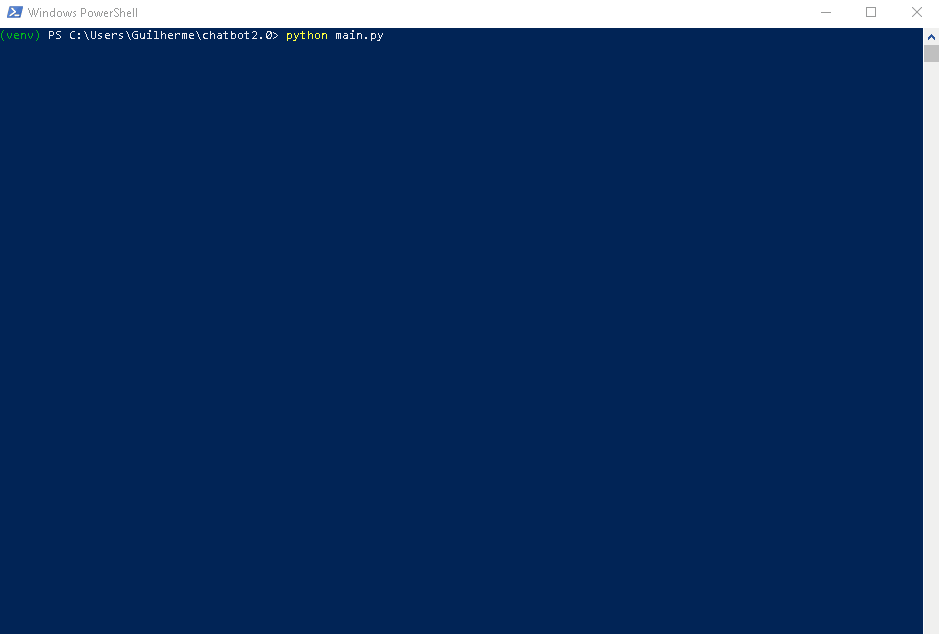
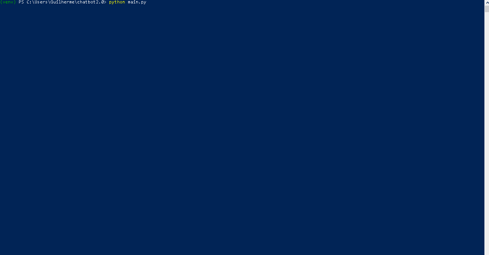

# Alfred, um agente de IA especialista em Criptomoedas.

## 📖 índice:

- [Sobre o Projeto](#sobre-o-projeto)
- [Como Usar](#como-usar)
- [Rodando no VS Code (Opcional)](#rodando-no-vs-code-opcional)
- [Exemplos de Uso](#exemplos-de-uso)
- [Requisitos](#requisitos)
- [Licença](#licença)

## 📌 Sobre o Projeto:

Alfred é um agente de IA que fornece comparativos, informações e consultas de Criptomoedas em tempo real. Utiliza o modelo **Google Gemini 1.5 Flash** para interatividade com o usuário e a **API CoinGecko** para obter dados confiáveis sobre os ativos digitais. Ele interpreta comandos em linguagem natural, você pode perguntar sobre Bitcoin, Ethereum, Cardano, Solana, entre outros.

## 🔧 Como Usar:

### 📦 1. Clone o repositório:

No PowerShell ou terminal:

```powershell
git clone https://github.com/GuilhermeSantamaria/alfred-cripto-agent.git
cd alfred-cripto-agent
```

### 🐍 2. Crie e ative um ambiente virtual Python:

```powershell
python -m venv venv
.\venv\Scripts\Activate
```

### 📦 3. Instale as dependências

```powershell
pip install -r requirements.txt
```

### 🔑 4. Configure sua chave da API Gemini

Use o arquivo `.env.example` como base. Crie um `.env` na raiz do projeto com a seguinte linha:

```powershell
GOOGLE_API_KEY=sua_chave_aqui
```

🔐 Substitua `sua_chave_aqui` pela sua chave obtida no [Google AI Studio](https://aistudio.google.com/app/apikey).

## 💡 Rodando no VS Code (Opcional)

1. Abra a pasta `alfred-cripto-agent` no VS Code
2. Pressione `Ctrl + Shift + P` e selecione `Python: Select Interpreter` → escolha `./venv`
3. Abra o arquivo `main.py` e clique no botão ▶️ "Run Python File"

---

A resultado esperado após realização das instruções é a apresentação do Agente de IA:


Se você seguiu todos os passos corretamente, já pode conversar com o Alfred pelo prompt ou terminal.

---

## 🧠 Exemplos de Uso

Utilize o Alfred para perguntas como:

- `Quais os ativos mais valorizados nas últimas 24h?`
- `Compare Bitcoin, Ethereum e Solana`
- `Quantas moedas estão em queda hoje?`
- `Qual a variação percentual do Ethereum?`

Receba respostas com dados atualizados das últimas 24 horas:



Defina uma quantidade "x" de Criptomoedas para obter os dados ou diga sobre quais ativos em específico você deseja que o Alfred traga informações da CoinGecko:


Solicite dados de Preço, Variação percentual em 24hrs, Capitalização de Mercado e Volume de Negociação em 24hs.
Receba dados confiáveis em poucos segundos:



## 🧰 Requisitos

- Python 3.10 ou superior.
- Conta no Google AI Studio com chave de API ativa.
- Acesso à internet para consultas em tempo real na CoinGecko.

## 📄 Licença

Este projeto está licenciado sob a licença MIT.
